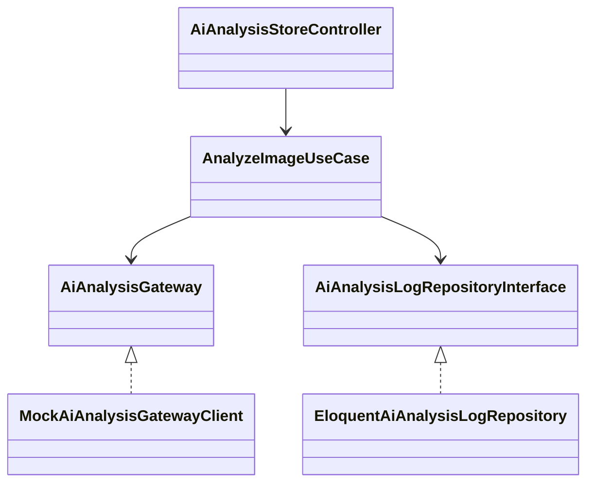
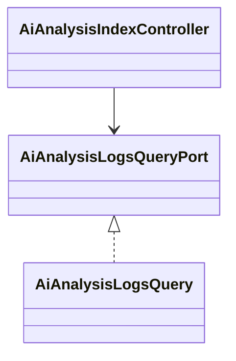
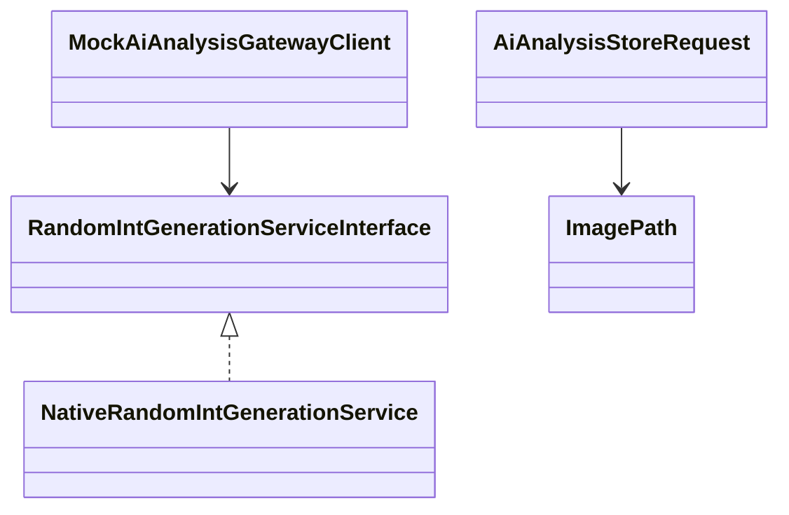

# skill-test

AI画像分析APIシステム - Laravel開発環境（Docker Compose）

## プロジェクト概要

画像ファイルパスを受け取り、AI分析APIで画像分類を行い、結果をデータベースに保存するシステムです。

### 主な機能

- Web UI（画像パス入力フォーム、分析ログ一覧）
- Mock AI分析API（開発用）
- クリーンアーキテクチャに基づいた設計（Application層、Infrastructure層、Domain層）

## 環境

- PHP 8.4 (FPM, Alpine)
- Nginx (Alpine)
- MySQL 8.0
- Composer 2.9
- Node.js 20

## 必要なもの

- Docker
- Docker Compose
- Make (macOSの場合は Xcode Command Line Tools が必要)

### Makeのインストール (macOS)

```bash
# インストール確認
make --version

# インストールされていない場合
xcode-select --install
```

## セットアップ

### 1. コンテナの起動

```bash
make build
make up
```

### 2. アクセス

- **HTTPS**: https://localhost:18443
- **HTTP**: http://localhost:18080
- **MySQL**: localhost:13307

### データベース接続情報

- Host: `skill-test-db` (コンテナ内) / `localhost` (ホストから)
- Port: `3306` (コンテナ内) / `13307` (ホストから)
- Database: `laravel`
- Username: `laravel`
- Password: `laravel_password`
- Root Password: `root_password`

## Makeコマンド

```bash
make help          # ヘルプを表示
make up            # コンテナを起動
make down          # コンテナを停止・削除
make build         # コンテナをビルド
make restart       # コンテナを再起動
make logs          # ログを表示
make ps            # コンテナ一覧を表示
make attach-app    # PHPコンテナにアタッチ
make pint          # コードフォーマット（Laravel Pint）
make pint-test     # フォーマットチェックのみ
make ide-helper    # IDE Helperファイル生成
make dump-autoload # Composer autoload更新
make clean         # コンテナ停止・ボリューム削除
```

## SSL証明書について

開発環境用の自己署名証明書はコンテナ起動時に自動生成されます。

- コンテナ起動（または再起動）のたびに新しい証明書が生成されます
- 証明書は `docker/nginx/ssl/` に保存されます
- 証明書の有効期限は365日です

ブラウザで証明書の警告が表示される場合は、安全でないページとして続行してください。

## コンテナ構成

- `skill-test-app`: PHP-FPMアプリケーションサーバー
- `skill-test-nginx`: Nginx Webサーバー
- `skill-test-db`: MySQL データベース
- `skill-test-network`: コンテナ間通信用ネットワーク
- `skill-test-db-data`: データベースの永続化ボリューム

## アプリケーションアーキテクチャ

- ユースケース駆動構成です。`app/Application` にユースケース (`UseCases`)、入力 DTO (`Input`)、および外部境界のポート (`ClientGateways`, `QueryPorts`) を配置しています。
- 今回の要件では明確なドメインロジックが少ないため、ユースケースやサービスなどアプリケーション層側が中心となる設計にしています。
- 依存関係は `AppServiceProvider` で解決します。`AiAnalysisGateway` は `MockAiAnalysisGatewayClient`（`Infrastructure/Api`）にバインドされ、リポジトリやクエリも同様に `Infrastructure` 直下の実装へマップされます。
- ドメイン永続化は `Domain\AiAnalysisLog\Repositories\AiAnalysisLogRepositoryInterface` を境界に、Eloquent 実装 (`infrastructure/Persistence`) を差し替え可能にしています。
- `MockAiAnalysisGatewayClient` は 25% の確率で `success=false` を返し、それ以外はハッシュ化したクラス/信頼度を決定します。乱数生成は `Application/Services/Random` 配下の `RandomIntGenerationServiceInterface` 経由で DI されるため、テストでは任意の値を供給できます。
- 画像パスの整形・検証は `Application/ValueObjects/ImagePath` に集約し、FormRequest やユースケースで同じ仕様を共有しています。

### 依存関係図（クラス図）

分析実行（フォーム入力→ユースケース→AIゲートウェイ／ログ保存）

AiAnalysisStoreController: 画像パスフォームのハンドラ
AnalyzeImageUseCase: 分析実行とログ保存をオーケストレーションするユースケース
AiAnalysisGateway: AI分析APIを抽象化したポート
AiAnalysisLogRepositoryInterface: 分析ログ永続化のポート
MockAiAnalysisGatewayClient / EloquentAiAnalysisLogRepository: 上記ポートのインフラ実装

ログ表示（トップページでログを取得）

AiAnalysisIndexController: ログ一覧画面のハンドラ
AiAnalysisLogsQueryPort: ログ取得のポート
AiAnalysisLogsQuery: ログ一覧を取得する Eloquent 実装

補助サービス（モックAI・乱数生成・画像パスVO）

MockAiAnalysisGatewayClient: 開発用のモックAIクライアント
RandomIntGenerationServiceInterface / NativeRandomIntGenerationService: 25%失敗ロジックとハッシュ算出を担うサービス
AiAnalysisStoreRequest / ImagePath: 入力値を検証・正規化する FormRequest と ValueObject

## テスト

```
make test
```
または
```
docker-compose exec skill-test-app php artisan test
```

実行結果（2025-11-11 時点）

```
PASS  Tests\Unit\MockAiAnalysisGatewayClientTest
PASS  Tests\Feature\AiAnalysisStoreTest
```

ユニットテストではモック AI クライアントの 25% 失敗やユースケースの成功/失敗を検証しています。
